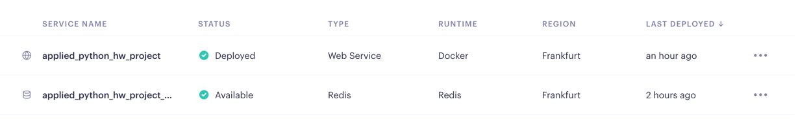

# applied_python_hw_project
Код сервера находится в файле `main.py`

Запуск сервера на локальном компьюторе через `docker-compose`:
```bash
docker-compose up --build
```

Остановить можно `ctrl+c` и далее обязательно выполнить команду
```bash
docker-compose down
```
Сейчас сервер развернут на платформе [Render](URL "https://dashboard.render.com")

### Проверка работы сервера
Во время развертывания сервера проверяется соединения с `Redis` сервером, если все хорошо, то в логах Вы увидите `Соединение с Redis успешно установлено через SSL.`

Для проверки функционала, запустите `service.ipynb`, он обратится к серверу и запустит тест по всему функционалу

Сервер откликается по ссылке `[https://applied-python-hw-project.onrender.com](https://applied-python-hw-project.onrender.com/docs)https://applied-python-hw-project.onrender.com/docs`
